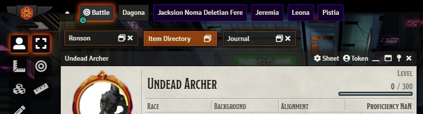
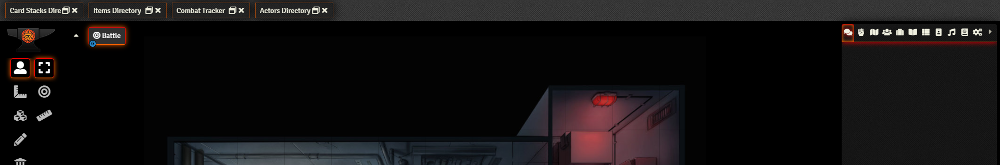
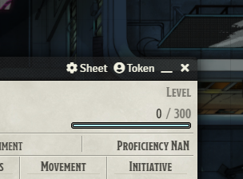
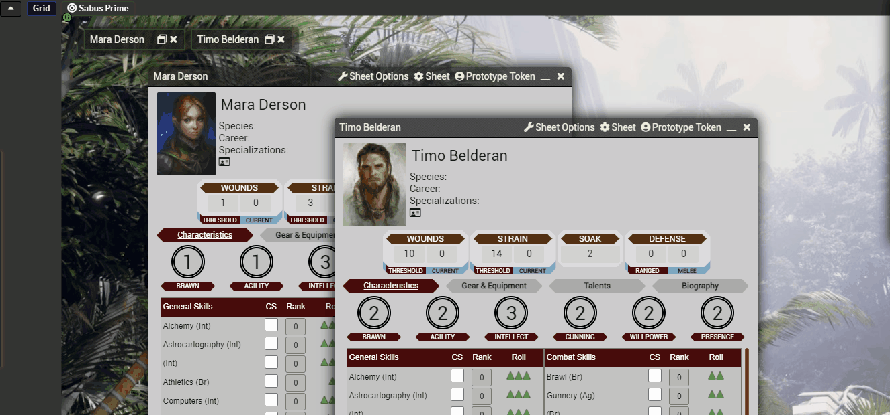
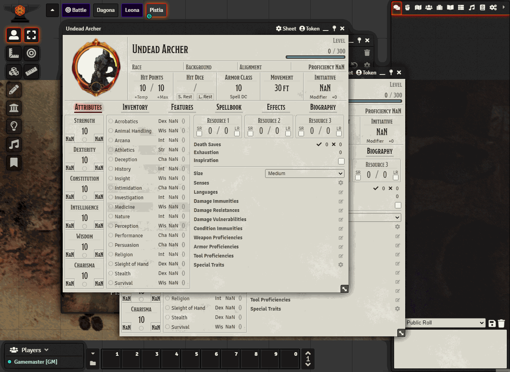

    
# JV's Window Controls for Foundry VTT

Window Taskbar and Window Buttons: Minimize, Maximize and Pin floating Windows. Configurable.

Organized Minimized mode allows minimizing windows on a fixed horizontal taskbar located on top or bottom.

### _Created by: JeansenVaars_
#### [This module was made for free, with joy, long nights and because of hundred windows needed it, so tons of coffee :D!](https://ko-fi.com/jeansenvaars)

**New Top Taskbar mode!** 

**Recommended Together with [Minimal UI](https://github.com/saif-ellafi/foundryvtt-minimal-ui)**

## Features
### Minimize button (Default: On)
Adds a minimize button that does the same as double-clicking the header

### Organized Minimize (Default: On - Top with Bar)
Allows minimizing windows into a horizontal taskbar. Possible options are:
* **Top**: Minimizes all windows on an invisible horizontal taskbar at the top of the screen below scenes
* **Bottom**: Minimizes all windows on an invisible horizontal taskbar located at the bottom of the screen
* **Top with Bar (Default)**: Minimize all windows inside a bar at the top in which minimized windows will be locked
* **Bottom with Bar**: Minimize all windows inside a bar at the bottom in which minimized windows will be locked
* **Top Taskbar**: All open windows (within supported) are shown on a dedicated space on top of the canvas.
* **Disabled**: Default behavior in Foundry. Minimizes wherever the window was originally.

### Pinned Button (Default: On)
* Adds a pin button on window controls, to prevent them from being closed while pinned.
* Pressing `ESC` will close all windows except Pinned windows. Double tapping `ESC` will minimize them instead (Configurable)
* This is useful for very important sheets that we never want to lose, and find them quickly.
* Setting `Remember Pinned Windows` will restore pinned windows across sessions. Disabled by default.

### Maximize Button (Default: Off)
Adds a maximize button that will expand resizable windows to the maximum available size. Can be restored with the same button.

**minimize and close buttons (Default):**

**New experimental Persistent Window Bars!**

**All options enabled, showing a pinned window that cannot be closed:**

## By JeansenVaars

## Check out my other modules!
* Minimal UI
* Scene Preview
* Super Select

# Appreciations
* Thanks to libWrapper by ruipin: UI is less prone to conflicts!
* Thanks to the FoundryVTT Discord community for the amazing issue reports and feedback.
* Thanks to Grayhead for the German translations!

# License
[MIT License](./LICENSE.md)

# Powered By

Thanks to JetBrains I can work on this project using **WebStorm**.
