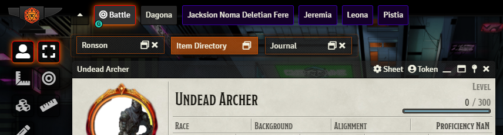
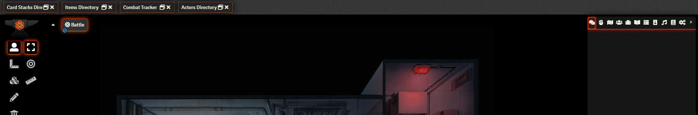
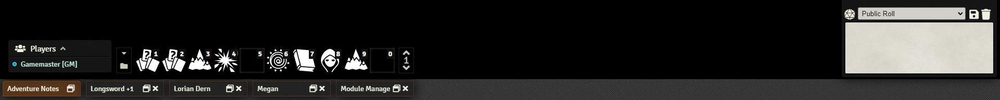
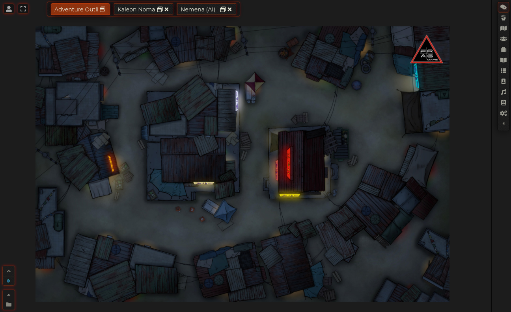
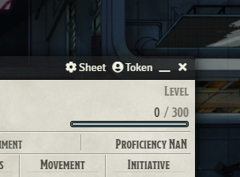
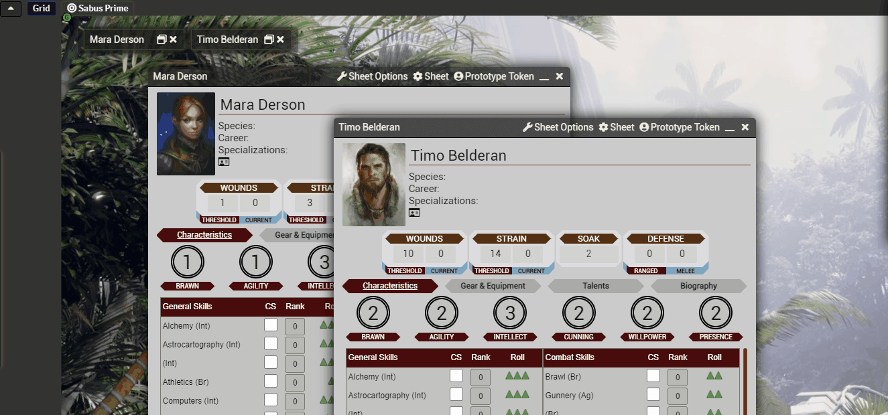
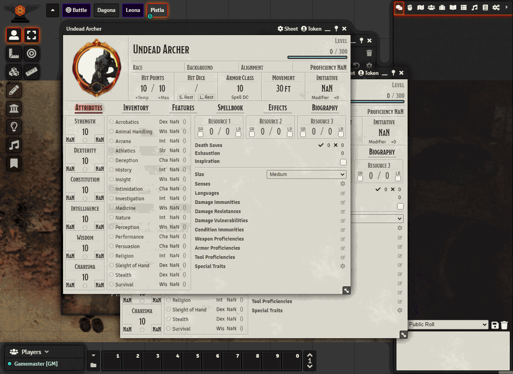
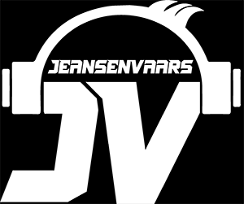

    
# JV's Window Controls for Foundry VTT

Organize and pin floating windows. Minimize sheets on the canvas, in a docked bar, or on a dedicated taskbar.

**Foundry VTT v14** · requires [lib-wrapper](https://foundryvtt.com/packages/lib-wrapper)

### _Created by: JeansenVaars_
#### [This module was made for free, with joy, long nights and because of hundred windows needed it, so tons of coffee :D!](https://ko-fi.com/jeansenvaars)

**Taskbar Top**

**Taskbar Bottom**

**Recommended together with [Minimal UI](https://github.com/saif-ellafi/foundryvtt-minimal-ui)**

## Features

### Minimize button (default: on)
Adds a minimize button that works like double-clicking the window header. Header order is always **Minimize · Pin · Close**.

### Minimize layout (default: Docked Bar Top)
Controls where minimized windows live:

| Setting | Behavior |
|---------|----------|
| **Floating Top / Bottom** | Minimized tabs float on the canvas and can be moved |
| **Docked Bar Top / Bottom** | Minimized tabs sit in a visible bar and stay locked in place |
| **Taskbar Top / Bottom** | A permanent strip above or below the canvas shows open and minimized windows as tabs |
| **Disabled** | Foundry default — windows minimize in place |

Most layout and button settings apply to open windows immediately without reloading Foundry.

### Pin button (default: on)
* Pin important sheets so they cannot be closed — only minimized
* Pinned headers are tinted; the pin button hides while minimized to save tab space
* Closing a pinned window (including with `ESC`) minimizes it instead

### Remember pinned windows (default: off)
Pinned windows reopen automatically when you start a new session. The module restores the correct sheet for:

* Sidebar actor templates
* Linked singleton characters (one shared actor)
* Individual unlinked tokens on the battle map

After upgrading from 1.x, unpin and re-pin once if a token sheet does not restore correctly.

### Taskbar color
Background color for Taskbar Top and Taskbar Bottom modes. Supports transparency.

**All options enabled, with a pinned window:**

## Installation

1. Install and enable **lib-wrapper**
2. Install **Window Controls** (`window-controls`)
3. Configure options under **Configure Settings → Module Settings → Window Controls**

## Related projects

This is the original **Window Controls** module. [Window Controls Next](https://github.com/paulcheeba/window-controls-next) is a separate fork with a different feature set, dependency chain, and package id (`window-controls-next`). The two modules should not be installed together.

## By JeansenVaars

## Check out my other modules!
* [Minimal UI](https://github.com/saif-ellafi/foundryvtt-minimal-ui)
* Scene Preview
* Super Select

## Appreciations
* Thanks to [libWrapper](https://foundryvtt.com/packages/lib-wrapper) by ruipin — fewer UI conflicts with other modules
* Thanks to the Foundry VTT Discord community for issue reports and feedback
* Thanks to Grayhead for the German translations
* Thanks to Brother Sharp for the Japanese translations

## License
[MIT License](./LICENSE.md)

## Powered By

Thanks to JetBrains I can work on this project using **WebStorm**.
